# Como gerar aplicações com o DB-First (banco de dados pronto)

## Banco de Dados
Utilizaremos o SQL Server para a criação dos nosso bancos de dados. Outros SGBDs podem ser utilizados, mas isso altera a stringo de conexão e os pacotes importados do .Net para geração do código.

### Conexão inicial

Utilize sempre a conexão do LocalDB criado pelo Visual Studio. Caso prefira utilizar a conexão NOME-COMPUTADOR\SQLEXPRESS, adapte os códigos com essa troca e conecte-se ao SQL Server apropriadamente.

```
(localdb)\MSSQLLocalDB
```
Essa é a tela de conexão do SQL Server Management Studio
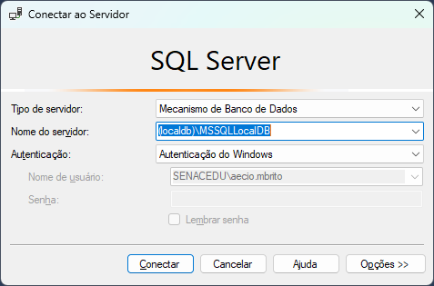

Pode criar um novo script clicando no botão "Nova Consulta"
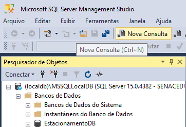

### Criação do Banco de Dados


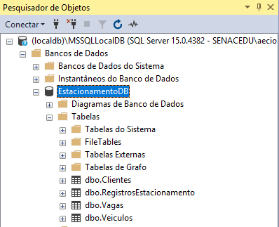

## Aplicação

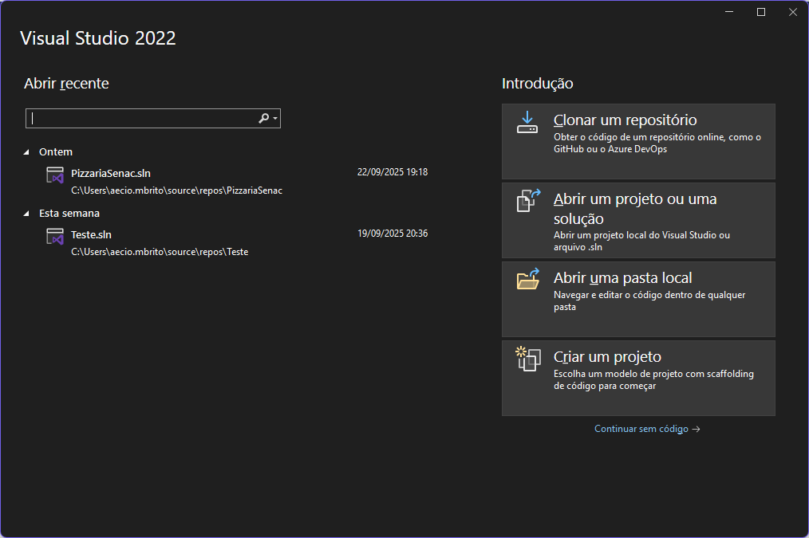


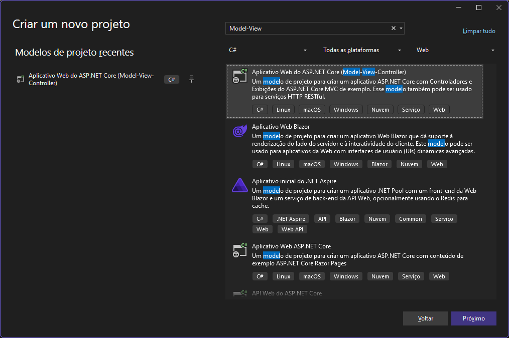

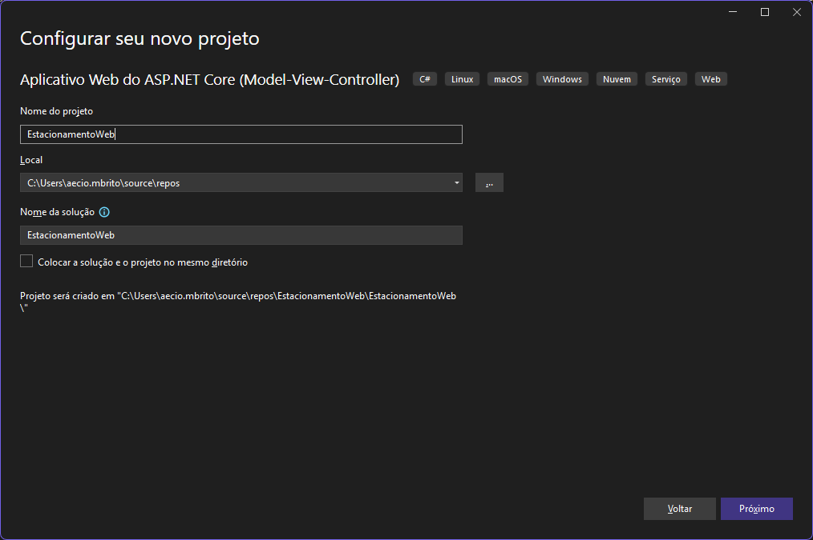


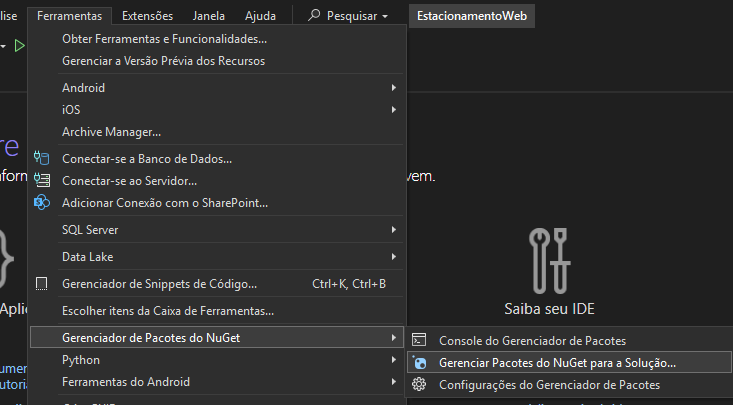

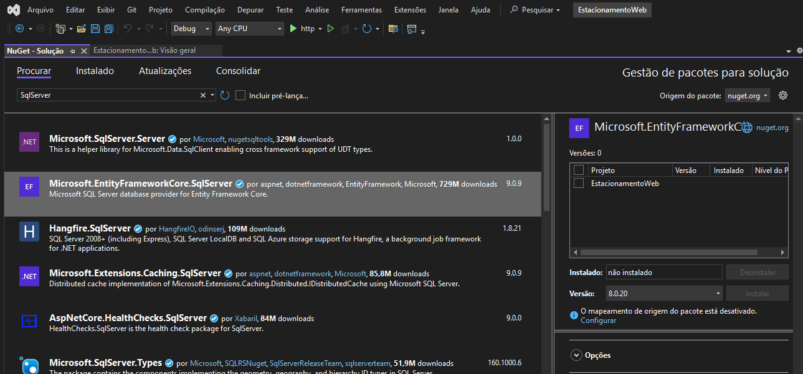

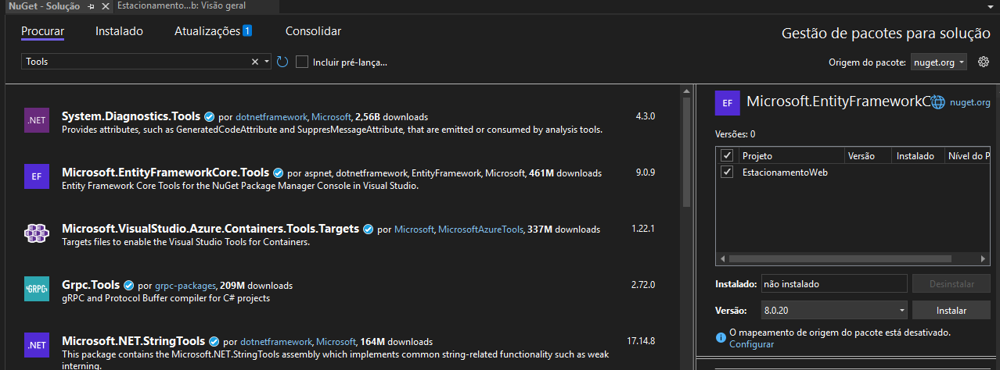

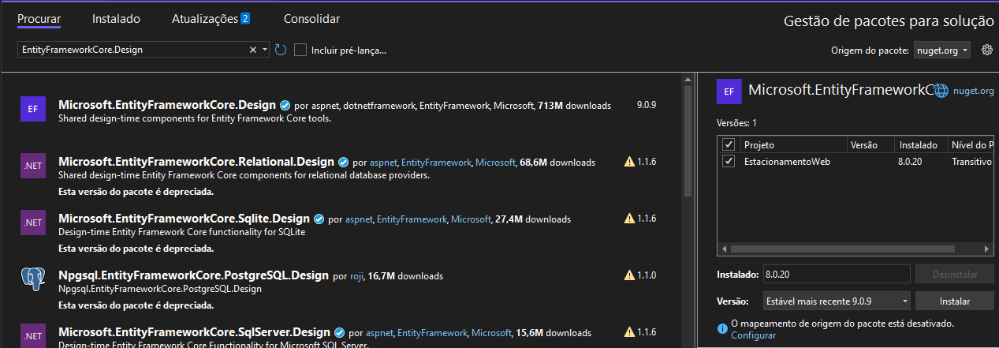


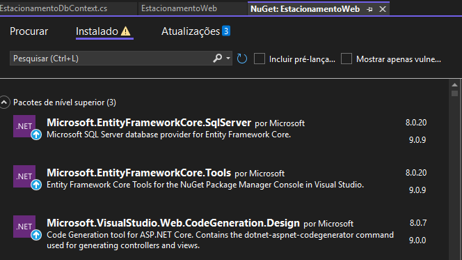

##### mudar pra esse aqui


```json
"ConnectionStrings": {
  "EstacionamentoWebContext": "Server=(localdb)\\mssqllocaldb;Database=EstacionamentoDB;Trusted_Connection=True;MultipleActiveResultSets=true"
}
```

```Csharp
Scaffold-DbContext "Server=(localdb)\MSSQLLocalDB;Database=EstacionamentoDB;Trusted_Connection=True;TrustServerCertificate=True;" Microsoft.EntityFrameworkCore.SqlServer -OutputDir Models
```

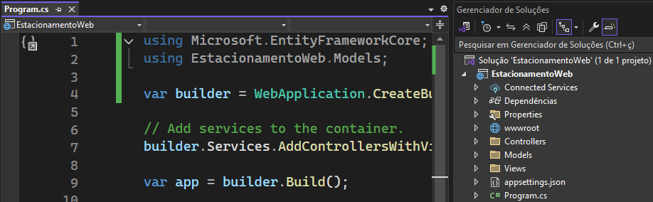